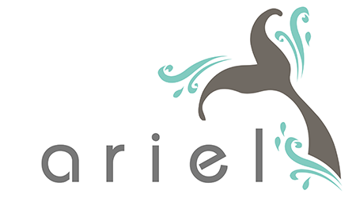

A software environment providing a collection of APIs and services for processing nuclear and particle physics event data.

This is a modified version of Fermilab's
[*art*](https://art.fnal.gov/) event processing framework and related
tools.  The main modifications are with the build system.  All
packages in this repository can be build from source without the use
of Fermilab's UPS package manager, in the same way as other standard
CMake-based software distributions.

This repository contains the source code of the
[*art*](https://cdcvs.fnal.gov/redmine/projects/art/wiki/Series_306/),
[*gallery*](https://cdcvs.fnal.gov/redmine/projects/gallery/wiki/Series_115/)
and [*critic*](https://cdcvs.fnal.gov/redmine/projects/critic/wiki/)
suites with small patches, mainly to accommodate the modified build
system and additional platforms and compilers. At present, the build
system uses a heavily modified version of Fermilab's
[cetbuildtools](https://cdcvs.fnal.gov/redmine/projects/cetbuildtools/wiki/).

This release is based on *art* 3.06.03.

### System Requirements

Minimum system requirements/dependencies (approximate, newer is better):

* Recent Linux or macOS. Examples: CentOS 8, macOS 10.14
* C++17 compiler (gcc 8, clang 10, Xcode 11)
* [CMake](https://cmake.org/) 3.12
* [ROOT](https://root.cern/) 6.12.6
* [Boost](https://www.boost.org/) 1.66
* [SQLite](https://www.sqlite.org/) 3.20.1
* [cppunit](https://www.freedesktop.org/wiki/Software/cppunit/) 1.13.2
* [TBB](https://www.threadingbuildingblocks.org/) 2018_U2
* Python 3.6
* Perl 5.18

Additional dependencies on macOS:

* [GNU getopt](https://github.com/karelzak/util-linux/) (any version)

ROOT must have been compiled with the exact same compiler that will be used for building ARIEL.

Generally, dependencies can have any version at or above the minimum specified;  an exact version match is not required. One can thus upgrade ARIEL without necessarily having to pull in upgrades of various large dependencies as well. (This is the typical behavior for Unix software distributions.) If ARIEL versions and dependency versions are to be locked, this should be handled with a suitable external package manager.

The following packages are included in this repository as submodules because they are often not readily available through the platform package manager:

* [CLHEP](https://proj-clhep.web.cern.ch/proj-clhep/) 2.4.1.3
* [catch](https://github.com/catchorg/Catch2/) 2.13.3
* [range-v3](https://github.com/ericniebler/range-v3/) 0.11.0

There is no need to install these two components separately.

### Building

* Install dependencies listed above
* Clone this repository and `cd` to the repository root directory:

~~~~~~~~~~bash
   git clone  https://github.com/JeffersonLab/ARIEL.git
   cd ARIEL
   git submodule update --init
~~~~~~~~~~

* Pick an installation location. Currently, the build process requires installing each subpackage immediately after building. For convenience, set an environment variable that points to the top of the installation tree. For example

~~~~~~~~~~bash
   export ARIEL=~/Software/ARIEL
~~~~~~~~~~

* Run the build script. The script expects the installation location as its first argument:

~~~~~~~~~~bash
   ./build-and-install.sh $ARIEL
~~~~~~~~~~

   This will take a while. Expect 10-20 minutes on a modern 8-core machine.
* Run the tests to ensure a correct build:

~~~~~~~~~~bash
   ./run-tests.sh
~~~~~~~~~~

* Set up the runtime environment in your shell (assuming you use
[environment modules](https://modules.readthedocs.io/en/latest/)):

~~~~~~~~~~bash
   module use $ARIEL/modulefiles
   module load ariel
~~~~~~~~~~

   Alternatively, there is a bash setup script:

~~~~~~~~~~bash
   source $ARIEL/bin/setup.sh
~~~~~~~~~~

### Using the workbook

See the [workbook README](examples/workbook/README.md)
 
### Containers

A definition file for a Singularity container can be found in the `container` directory.

### Repository Organization

The _base_ branch contains selected point releases of the unmodified Fermilab sources. _develop_ contains patches and additions to those sources. ARIEL releases correspond to tags on the _develop_ branch.

### About the name

ARIEL: Art-based integrated event-processing library.

### License

Standard 3-clause BSD. See in the included [LICENSE](LICENSE.md) files.

Author:  Ole Hansen (ole@jlab.org)
