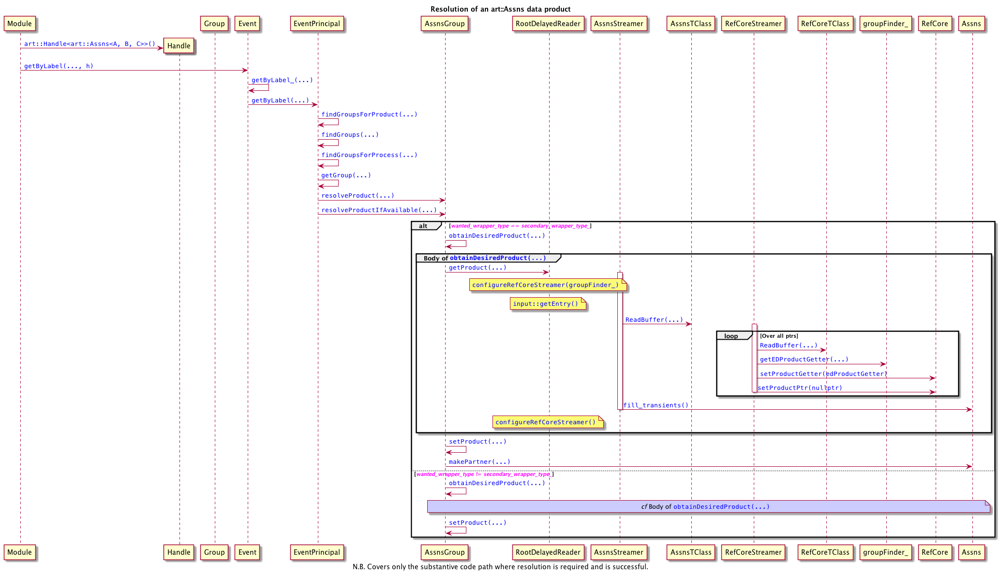

# `art::Ptr`{.cpp}, `Assns`{.cpp} and friends, from a threading perspective.

## `art::RefCore`{.cpp}

* Files:  `canvas/Persistency/Common/RefCore.{h,cc}`, `canvas/Persistency/Common/RefCoreStreamer.{h,cc}`.

* `art::RefCore::pushBackItem(...)`{.cpp} should not be a member of `art::RefCore`{.cpp}, but its functionality should instead be subsumed into `art::PtrVectorBase::updateCore(...)`{.cpp}, the only place in the _art_ suite from which it is called.

* After the removal of `art::RefCore::pushBackItem(...)`{.cpp}, the only non-`const`{.cpp} member function is `swap()`{.cpp}.

* *THREADING* There are two mutable items: `art::RefCore::RefCoreTransients::itemPtr`{.cpp} and `art::RefCore::RefCoreTransients::productGetter`{.cpp}. These are only modified directly by `art::RefCore::setProductPtr(...)`{.cpp} and `art::RefCore::setProductGetter(...)`{.cpp} respectively. Unfortunately these functions are themselves public. In the current _art_ suite, only two classes own an `art::RefCore`{.cpp}: `art::Ptr`{.cpp} and `art::PtrVector`.

* *THREADING* `art::configureRefCoreStreamer(...)`{.cpp} is called from several places: `art::completeRootHandlers()`{.cpp}, `template <typename PROD> void art::MixOp<PROD>::readFromFile(...)`{.cpp}, `unique_ptr<EDProduct> art::RootDelayedReader::getProduct_(...)`{.cpp} (at the beginning and end of the resolution procedure), `void gallery::DataGetterHelper::initializeStreamers()`{.cpp} and `art::EDProduct const* gallery::BranchData::getIt() const`{.cpp}. This is a _major_ choke point from a threading point of view: either data access must be serialized, or another solution must be found.

## `art::Ptr`{.cpp}

* File: `canvas/Persistency/Common/Ptr.h`.

* *THREADING* `template <typename T> class art::Ptr`{.cpp} has no non-`const`{.cpp} members, but does modify the `mutable`{.cpp} `art::RefCore::RefCoreTransients::itemPtr` via `art::RefCore::setProductPtr(...)`{.cpp} in the private function `art::Ptr<T>::getData_(...)`{.cpp}, which is invoked directly via the public member function `art::Ptr<T>::operator ->()`{.cpp} and indirectly via `art::Ptr<T>::operator *()`{.cpp} and `art::Ptr<T>::get()`{.cpp}. Since `art::Ptr<T>`{.cpp} contains an `art::RefCore`{.cpp} by value, this only has threading implications for an `art::Ptr<T>`{.cpp} shared across multiple threads. However, a call to `art::Ptr<T>::getData_(...)`{.cpp} does call `art::EDProductGetter::getIt()`{.cpp}, which will interact with the data model and will almost certainly have threading implications of its own. See lifecycle sequence diagrams for `Ptr`{.cpp}:

"){align="top"} "){align="top"} "){align="top"} "){align="top"} "){align="top"}.

See also the example of [streaming in `Ptr`{.cpp} objects as part of an `Assns`{.cpp} read operation](#assns-read), below.

* *THREADING* In the constructor `template <typename T> template <typename H> Ptr<T>(H const & handle, key_type idx)`{.cpp}, `H::product(..)`{.cpp} is called, which may interact with the data model and will almost certainly have threading implications of its own.

* The auxiliary helper class template `ItemGetter`{.cpp} and its specializations would not be necessary if `art::Handle`{.cpp} somehow provided access to `art::Wrapper::setPtr`{.cpp}

## `art::PtrVectorBase`{.cpp} & `art::PtrVector`{.cpp}

* Files: `canvas/Persistency/Common/PtrVector.{h,cc}`, `canvas/Persistency/Common/detail/setPtrVectorBaseStreamer.{h,cc}`.

* `art::PtrVectorBase`{.cpp} exposes `setProductGetter(...)`{.cpp} to the public interface (see above).

* The public function `template <typename T> typename art::Ptr<T>::key_type art::PtrVectorBase::key(Ptr<T> const &ptr)`{.cpp} is completely unnecessary and should be deprecated prior to removal: `ptr.key()`{.cpp} should be called instead.

* Non-`const`{.cpp} function `art::PtrVectorBase::reserve(...)`{.cpp} should be made private: it is anyway shadowed by `art::PtrVector::reserve(...)`{.cpp}.

* `const`{.cpp} function `art::PtrVectorBase::fillPtr()`{.cpp} should be made private, as its only external use is by `friend class art::detail::PtrVectorBaseStreamer`{.cpp}.

* *THREADING* The pure virtual functions `art::PtrVectorBase::fill_offsets(...)`{.cpp}, `art::PtrVectorBase::fill_from_offsets(...) const`{.cpp}, and,  `art::PtrVectorBase::zeroTransients()`{.cpp} are private and called only from `friend class art::detail::PtrVectorBaseStreamer`{.cpp}.

* `art::detail::setPtrVectorBaseStreamer()`{.cpp} is called from `art::completeRootHandlers()`{.cpp} and `void gallery::DataGetterHelper::initializeStreamers()`{.cpp}, neither of which have threading issues because they are called in the single-threaded setup phase.

## `template <typename L, typename R, typename D = void> art::Assns`{.cpp}

* File: `canvas/Persistency/Common/Assns.h`

* The function `left_first()`{.cpp} should be `const`{.cpp}. It could be static except for a deficiency in ROOT's "ioread" rules mechanism.

* *THREADING* Non-`const`{.cpp} functions are `swap(...)`{.cpp}, `swap_(...)`{.cpp}, `addSingle(...)`{.cpp}, `template <typename L, typename R> void art::Assns<L, R, void> fill_transients()`{.cpp}, and `template <typename L, typename R> void art::Assns<L, R, void> fill_from_transients()`{.cpp}. These functions should not be called simultaneously with each other, or with any observers. The latter two are called only during stream-in or stream-out operations.

* *THREADING* `template <typename L, typename R> class art::detail::AssnsStreamer`{.cpp} is a friend of the base class `template <typename L, typename R> void art::Assns<L, R, void>`{.cpp} and calls the above `fill_X`{.cpp} functions during streaming.

* *THREADING* There are three mutable data members: these are only modified during streaming operations.

* *THREADING* See the figure below for an example of streaming in an `Assns`{.cpp} data product and the calls involved. The `RefCoreStreamer` is particularly problematic, here.

{#assns-read}

## `template <typename B, typename D = void> art::Find{One,Many}{,P}`{.cpp}

* Files `canvas/Persistency/Common/Find{One,Many}.h.in` -> `canvas/Persistency/Common/Find{One,Many}{,P}.h` (generated).

* Neither template has public non-`const`{.cpp} member functions. Each template has two protected non-`const` member functions in the base, `bCollection()`{.cpp} and `setStoredException(...)`{.cpp}, both of which are only called from constructors.
